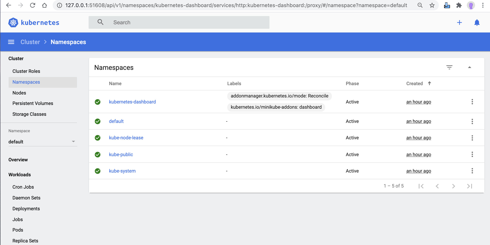
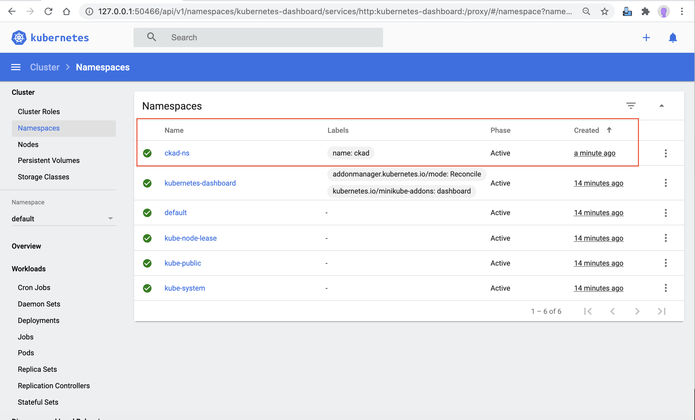

Namespaces provide a way to keep objects organized within the cluster. Every object belongs to a namespace. When no namespace is specified teh cluster will assume the 'default' namespace.

Kubernetes starts with four initial namespaces:
* **default** The default namespace for objects with no other namespace
* **kube-system** The namespace for objects created by the Kubernetes system
* **kube-public** This namespace is created automatically and is readable by all users (including those not authenticated). This namespace is mostly reserved for cluster usage, in case that some resources should be visible and readable publicly throughout the whole cluster. The public aspect of this namespace is only a convention, not a requirement.
* **kube-node-lease** This namespace for the lease objects associated with each node which improves the performance of the node heartbeats as the cluster scales


## Pre-requsitie
* Review [app-namespace.yaml](./app-namespace.yaml)

## Namespaces
* [kubectl create ns ckad-ns](create.sh)
* [kubectl apply -f ckad-ns.yaml](apply.sh)
* [kubectl get ns ckad-ns -o yaml](get.sh)
* [kubectl describe ns ckad-ns](describe.sh)
* [kubectl delete ns ckad-ns](delete.sh)


## ERROR's
* Execute 'kubectl create ckad-ns.yaml' multiple time, expect below errow
```````
Error from server (AlreadyExists): error when creating "ckad-ns.yaml": namespaces "ckad-ns" already exists
```````


## Dashboard Screenshots
### Before APP deploy or After APP delete


### After APP create or apply

