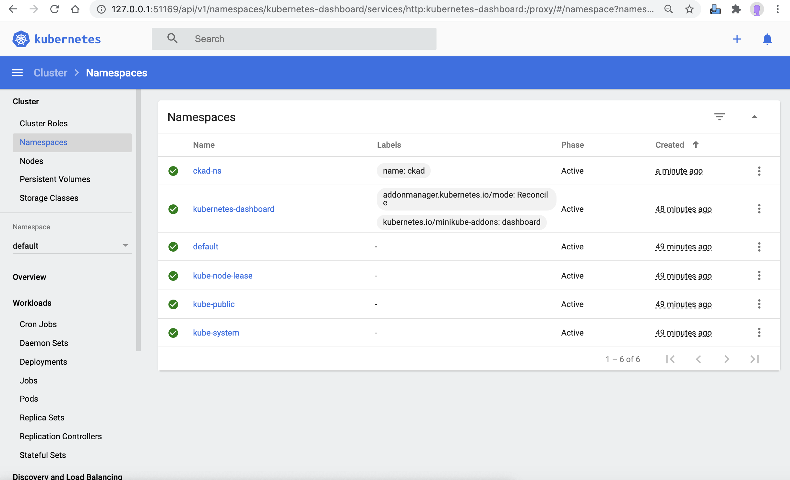

## Pre-requsitie
* Review [ckad-ns.yaml](./ckad-ns.yaml)

## Namespaces
* [kubectl create ns ckad-ns](create.sh)
* [kubectl apply -f ckad-ns.yaml](apply.sh)
* [kubectl get ns ckad-ns -o yaml](get.sh)
* [kubectl describe ns ckad-ns](describe.sh)
* [kubectl delete ns ckad-ns](delete.sh)


## ERROR's
* Execute 'kubectl create ckad-ns.yaml' multiple time, expect below errow
```````
Error from server (AlreadyExists): error when creating "ckad-ns.yaml": namespaces "ckad-ns" already exists
```````


## Dashboard Screenshots
### Before APP deploy or After APP delete


### After APP create or apply

