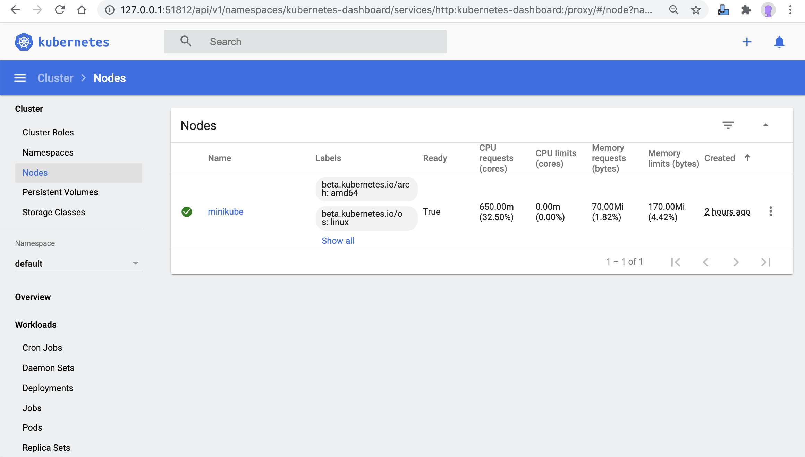

A node may be a virtual or physical machine, depending on the cluster. Each node contains the services necessary to run Pods, managed by the control plane. Typically minikube have only 1 node as master.

## Pre-requsitie
* Review [app-node.yaml](./app-node.yaml)

## Node
* [kubectl get nodes -o yaml](get.sh)
* [kubectl describe node minikube](describe.sh)
* [kubectl top node minikube](describe.sh)

## ERROR's
N/A

## Dashboard Screenshots
### Node

