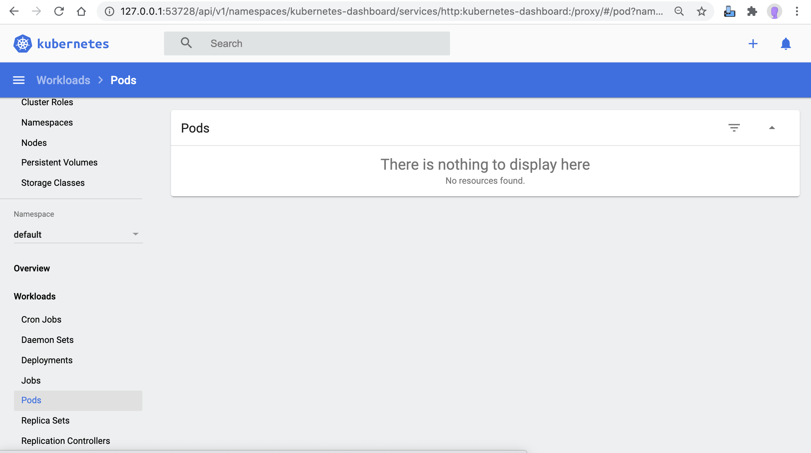
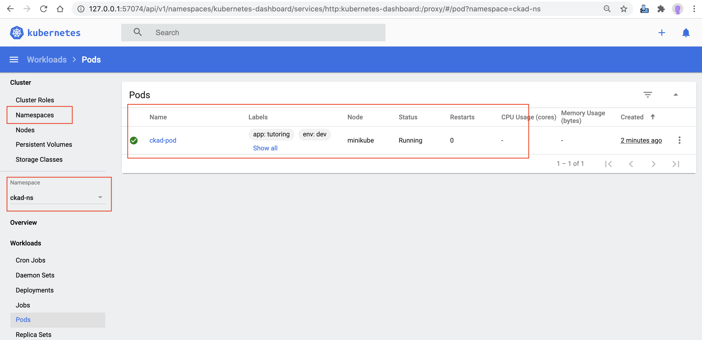

A Pod (as in a pod of whales or pea pod) is a group of one or more containers (such as Docker containers), with shared storage/network, and a specification for how to run the containers. A Pod's contents are always co-located and co-scheduled, and run in a shared context.

Reference: [K8S.io pods](https://kubernetes.io/docs/concepts/workloads/pods/pod-overview/)

## Pre-requsitie
* Review [Pod with Namespace](./app-pod.yaml)

## Namespaces
* [kubectl create -f app-pod.yaml](create.sh)
* [kubectl apply -f ckad-ns.yaml](apply.sh)
* [kubectl get pod ckad-pod -n ckad-ns -o yaml](get.sh)
* [kubectl describe pod ckad-pod -n ckad-ns](describe.sh)
* [kubectl delete pod ckad-pod -n ckad-ns && kubectl delete ns ckad-ns](delete.sh)

## ERROR's

## Dashboard Screenshots
### Before APP deploy or After APP delete

### After APP create or apply

