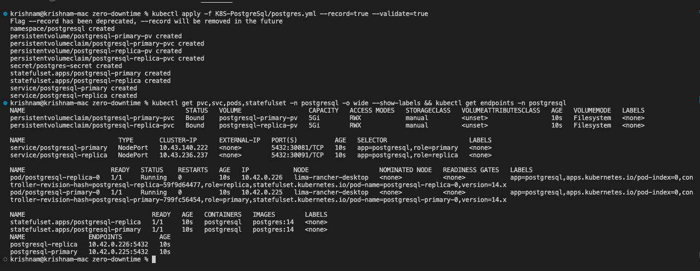

# Zero Downtime
- [GDoc details](https://docs.google.com/document/d/1n2TjVN6ubpUs01wPsqjOHSspc9jXwpi3rObD-JTwO7k/)

## Install PostgreSql 14.x in K8S namespace 'postgresql'
### pre-step
````
mkdir -p postgres-data && ln -s $(pwd)/postgres-data /tmp/postgres-data
````
### Primary database

#### Install
````
kubectl apply -f postgres-primary.yml --validate='strict'
````
#### Get details
````
kubectl get configmap,secrets,pvc,svc,pods,deploy,statefulset,endpoints -n postgresql -o wide --show-labels 
````

### Connect via kubectl exec
````
kubectl exec -it deploy/sts-primary -n postgresql -- psql -d mydatabase -U myuser 
````
### Database commands
#### List tables in schema
````
SELECT table_name FROM information_schema.tables WHERE table_schema='public';
````
#### Create table
````
drop table if exists tab_2; create table tab_12( a int); insert into tab_2 values(generate_series(1,5)); select * from tab_2;
````
#### Database dump
````
kubectl exec -it pod/sts-primary-7b4f86b4f9-lmhql -n postgresql -- pg_dump -d mydatabase -U myuser > db_backup.sql 
````

### Replica database
#### Install
````
kubectl apply -k postgres-replicas.yml --validate='strict'
````
#### Get details
````
kubectl get configmap,secrets,pvc,svc,pods,statefulset,endpoints -n postgresql -o wide --show-labels && kubectl get endpoints -n postgresql  
````
### Connect via kubectl exec
````
kubectl exec -it deploy/postgresql-replica -n postgresql -- psql -d mydatabase -U myuser
````
### Check replication from pod:Primary
````
kubectl exec -it pod/postgresql-primary-0 -n postgresql -- psql -d mydatabase -U myuser -c "select * from pg_stat_replication";
````
#### Validate from pod:Replica
````
kubectl exec -it pod/postgresql-replica-0 -n postgresql -- psql -d mydatabase -U myuser -c "select * from pg_stat_wal_receiver";
````

### Connect via client
#### Primary
- JDBC URL: jdbc:postgresql://localhost:30081/mydatabase
- User: myuser
- password: myPa$sw0rd
##### Read Replica-1
- JDBC URL: jdbc:postgresql://localhost:30091/mydatabase
- User: myuser
- password: myPa$sw0rd


### Uninstall
````
kubectl delete -f postgres-primary.yml --force=true --wait=false
````

## Reference commands
### Cluster ID
``````
kubectl get ns kube-system -o jsonpath='{.metadata.uid}'
``````
### Docs
- https://wiki.postgresql.org/wiki/Streaming_Replication
- https://www.postgresql.org/docs/14/warm-standby.html#STREAMING-REPLICATION

